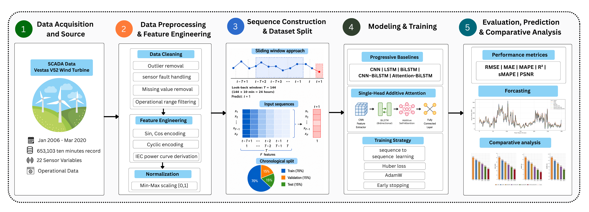
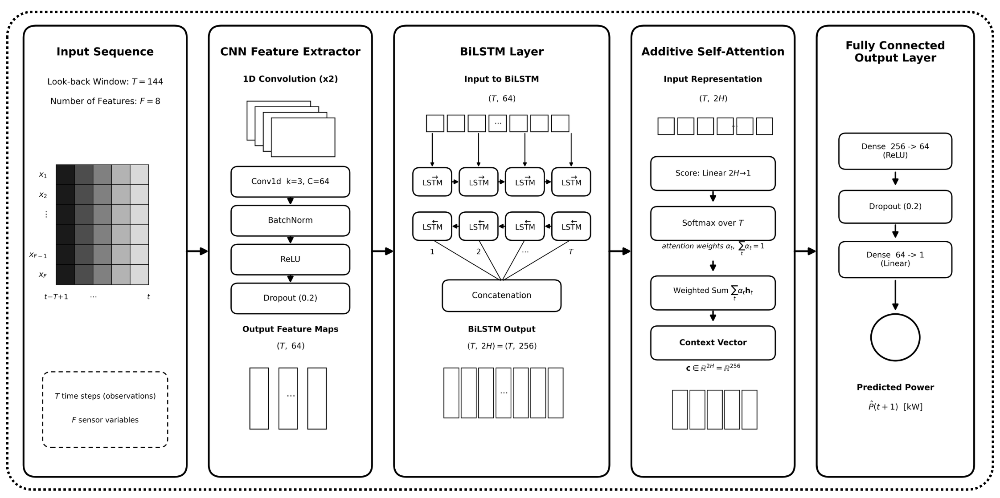

<div align="center">

# CNN-Attention-BiLSTM: A Hybrid Deep Learning Model for Wind Turbine Power Forecasting Using SCADA Data

**A modular, production-grade PyTorch implementation accompanying the manuscript:**
_"A Novel CNN-Attention-BiLSTM Hybrid Deep Learning Model for Wind Turbine Power Forecasting Using SCADA Data"_
Md. Uzzal Mia, Sajib Debnath, Arindam Kishor Biswas, Md. Sarwar Hosain, Tetsuya Shimamura

<br/>

[](https://www.python.org/)
[](https://pytorch.org/)
[](LICENSE)
[](tests)
[](https://github.com/psf/black)
[-blue>)](Data/README.md)
[](#)

</div>

---

## Table of Contents

- [Overview](#overview)
- [Dataset Information](#dataset-information)
- [Code Information](#code-information)
- [Repository Structure](#repository-structure)
- [Overall Architecture Diagram](#overall-architecture-diagram)
- [Hybrid Model Architecture Diagram](#hybrid-model-architecture-diagram)
- [Training Configuration](#training-configuration)
- [Installation & Environment Setup](#installation--environment-setup)
- [Quickstart / Usage](#quickstart--usage)
- [Output](#output)
- [Results](#results)
- [Testing](#testing)
- [Reproducibility Notes](#reproducibility-notes)
- [Citation](#citation)
- [License](#license)
- [Authors](#authors)
- [Acknowledgments](#acknowledgments)

---

## Overview

Short-term wind turbine power forecasting is central to reliable grid
operation, economic dispatch, and large-scale renewable energy integration.
This repository implements **CNN-Attention-BiLSTM**, a hybrid deep learning
architecture that fuses three complementary mechanisms in a single,
fully end-to-end differentiable pipeline:

- a **two-layer 1D CNN** for localized temporal feature extraction (short
  wind ramps, abrupt speed transitions, control transients),
- a **two-layer Bidirectional LSTM** for long-range, bidirectional
  sequential context, and
- a **single-head additive (Bahdanau-style) self-attention** mechanism for
  adaptive, interpretable time-step weighting.

The model is benchmarked on **14 years of 10-minute Vestas V52 SCADA
records** (653,103 samples, 22 sensor channels) from Dundalk Institute of
Technology (DkIT), Ireland — the longest single-turbine evaluation horizon
reported in the open literature — against five progressively more
expressive baselines (CNN, LSTM, BiLSTM, CNN-BiLSTM, Attention-BiLSTM)
across six complementary metrics (RMSE, MAE, R², MAPE, sMAPE, PSNR).

This codebase is a **clean-room, modular re-implementation** of the
architecture and full experimental protocol described in the paper —
preprocessing, all six architectures, training procedure, statistical
significance testing, seasonal and power-band analysis, and ablation
study — built to be readable, testable, and directly reusable for new
turbines, sites, or SCADA datasets, rather than a single monolithic
notebook.


---

## Dataset Information

| Property                            | Value                                                                                                       |
| ----------------------------------- | ----------------------------------------------------------------------------------------------------------- |
| Turbine model                       | Vestas V52                                                                                                  |
| Site                                | Dundalk Institute of Technology (DkIT), Ireland                                                             |
| Rated capacity                      | 850 kW                                                                                                      |
| Rotor diameter                      | 52 m                                                                                                        |
| Hub height                          | 60 m                                                                                                        |
| Data span                           | 30 Jan 2006 – 12 Mar 2020 (≈14 years)                                                                       |
| Sampling interval                   | 10 minutes                                                                                                  |
| Total raw records                   | 653,103                                                                                                     |
| Sensor channels                     | 22                                                                                                          |
| Cut-in / Rated / Cut-out wind speed | ≈3.5 / ≈14 / 25 m/s                                                                                         |
| Source                              | Byrne & MacArtain (2022), Mendeley Data, [doi:10.17632/tm988rs48k.2](https://doi.org/10.17632/tm988rs48k.2) |

The raw CSV is **not redistributed** in this repository — see
[`Data/README.md`](Data/README.md) for download instructions and the
expected column schema. Once placed at `Data/raw/`, the pipeline applies:

1. **Operational filtering** — retain `WindSpeed ∈ [0, 25] m/s`, `Power ≥
5 kW`; drop missing rows (no imputation).
2. **Circular wind-direction encoding** — `dir_sin = sin(πθ/180)`,
   `dir_cos = cos(πθ/180)`, resolving the 0°/360° discontinuity.
3. **Feature selection** — 8 final inputs: `WindSpeed, dir_sin, dir_cos,
StdDevWindSpeed, RotorRPM, Pitch, NacelTemp, GearOilTemp`.
4. **Min-Max normalization** — scalers fit on the training partition only.
5. **Sliding-window construction** — `T = 144` steps (24h lookback),
   single-step-ahead target.
6. **Chronological 70/15/15 split** — no shuffling, zero temporal leakage.

---

## Code Information

| Component                 | Details                                                                                                     |
| ------------------------- | ----------------------------------------------------------------------------------------------------------- |
| Language                  | Python ≥ 3.9                                                                                                |
| Deep learning framework   | PyTorch ≥ 2.0                                                                                               |
| Architectures implemented | CNN, LSTM, BiLSTM, CNN-BiLSTM, Attention-BiLSTM, **CNN-Attention-BiLSTM (proposed)**, + 4 ablation variants |
| Loss function             | Huber loss (δ = 1.0)                                                                                        |
| Optimizer                 | Adam (`weight_decay = 1e-5`); AdamW selectable via config                                                   |
| LR schedule               | ReduceLROnPlateau (patience 20, factor 0.5)                                                                 |
| Regularization            | Dropout (0.2), gradient-norm clipping (max-norm 1.0), early stopping (patience 15)                          |
| Evaluation metrics        | RMSE, MAE, R², MAPE, sMAPE, PSNR                                                                            |
| Statistical testing       | Bonferroni-corrected Wilcoxon Signed-Rank tests, rank-biserial effect size                                  |
| Diagnostics               | Seasonal (DJF/MAM/JJA/SON) and power-band (Low/Medium/High/Rated) decomposition, residual analysis          |
| Testing                   | 38 automated `pytest` unit/integration tests, incl. exact parameter-count regression tests vs. the paper    |
| CI                        | GitHub Actions — runs the full suite on Python 3.10 / 3.11 / 3.12                                           |

---

## Repository Structure

```
<repo-root>/
├── README.md                       <- you are here
├── LICENSE                         <- MIT
├── requirements.txt                <- pinned dependencies
├── setup.py                        <- `pip install -e .`
├── pytest.ini
├── .github/workflows/ci.yml        <- automated test suite (3x Python versions)
│
├── configs/
│   └── config.yaml                 <- single source of truth for every hyperparameter
│
├── Data/
│   ├── README.md                   <- dataset download instructions & schema
│   ├── raw/                        <- place the downloaded SCADA CSV here (gitignored)
│   ├── processed/                  <- optional cached intermediates (gitignored)
│   └── VestasV52_10_min_raw_SCADA_DkIT 30_Jan2006-12_Mar2020.csv
│
├── assets/                         <- README diagrams (generated by scripts/00)
│   ├── overall_model_architecture.png
│   └── hybrid_architecture.png
│
├── src/                             <- installable source tree (namespace: `wtpf`)
│   ├── __init__.py                   <- package metadata and overview
│   ├── config.py                    <- YAML -> dot-accessible Config object
│   ├── pipeline.py                  <- load -> clean -> engineer -> window orchestration
│   ├── experiment.py                <- train+evaluate a single model end-to-end
│   ├── data/                        <- loader, preprocessing, feature engineering, datasets
│   ├── models/                      <- CNN, LSTM, BiLSTM, hybrid and ablation variants
│   ├── training/                    <- Trainer, callbacks, profiling helpers
│   ├── evaluation/                  <- metrics, statistical tests, seasonal/power-band analysis
│   ├── visualization/               <- EDA and results plotting utilities
│   └── utils/                       <- seeding, logging, device resolution
│
├── scripts/                          <- thin CLI entry points (see Quickstart below)
│   ├── 00_render_diagrams.py
│   ├── 01_run_eda.py
│   ├── 02_train_single_model.py
│   ├── 03_train_all_baselines.py
│   ├── 04_run_ablation_study.py
│   ├── 05_statistical_significance.py
│   └── 06_full_evaluation_report.py
│
├── tests/                            <- 38 pytest tests across every subpackage
│
├── checkpoints/, figures/, results/  <- generated artifacts (gitignored, created on first run)
```

---

## Overall Architecture Diagram

End-to-end framework, from raw SCADA acquisition to comparative evaluation:



---

## Hybrid Model Architecture Diagram

The proposed CNN-Attention-BiLSTM, layer by layer (input `T=144, F=8`):




| Layer | Block                   | Configuration                              | Output shape |
| ----- | ----------------------- | ------------------------------------------ | ------------ |
| 1     | Input                   | 8 SCADA features, T=144                    | (B,144,8)    |
| 2–3   | Conv1D + BN + ReLU ×2   | filters=64, kernel=3, padding=1            | (B,64,144)   |
| 4     | Dropout + transpose     | p=0.2                                      | (B,144,64)   |
| 5–6   | BiLSTM ×2               | hidden=128/direction                       | (B,144,256)  |
| 7     | Additive self-attention | Linear 256→1, softmax over T, weighted sum | (B,256)      |
| 8     | Dropout                 | p=0.2                                      | (B,256)      |
| 9     | FC + ReLU + Dropout     | 256→64                                     | (B,64)       |
| 10    | FC (output)             | 64→1                                       | (B,1)        |

---

## Training Configuration

All hyperparameters live in [`configs/config.yaml`](configs/config.yaml) — nothing is hardcoded in the training loop.

| Hyperparameter           | Value                                           |
| ------------------------ | ----------------------------------------------- |
| Sequence length (T)      | 144 (24h @ 10-min)                              |
| Input features (F)       | 8                                               |
| Batch size               | 256                                             |
| Max epochs               | 100                                             |
| Loss function            | Huber (δ = 1.0)                                 |
| Optimizer                | Adam, lr = 1e-3, weight_decay = 1e-5            |
| LR scheduler             | ReduceLROnPlateau (patience = 20, factor = 0.5) |
| Gradient clipping        | max-norm = 1.0                                  |
| Early stopping           | patience = 15 (best-checkpoint restoration)     |
| Dropout                  | 0.2 (CNN, BiLSTM, attention, FC head)           |
| Train / Val / Test split | 70% / 15% / 15%, strictly chronological         |
| Random seed              | 42 (NumPy, PyTorch, CUDA)                       |
| Framework                | PyTorch                                         |

---

## Installation & Environment Setup

### Requirements

- Python ≥ 3.9
- (Optional) a CUDA-capable GPU — training also runs on CPU

### 1. Clone and create an environment

```bash
git clone <this-repository-url>
cd wind-turbine-power-forecasting

python -m venv .venv
source .venv/bin/activate        # Windows: .venv\Scripts\activate
```

### 2. Install dependencies

```bash
pip install -r requirements.txt
pip install -e .                  # installs the `wtpf` package in editable mode
```

### 3. Obtain the dataset

Follow [`Data/README.md`](Data/README.md) to download the Vestas V52 DkIT
SCADA CSV and place it at `Data/raw/VestasV52_10_min_raw_SCADA_DkIT.csv`
(or update `data.raw_csv_path` in `configs/config.yaml`).

### 4. Verify the installation

```bash
pytest -v
```

All 38 tests (preprocessing, feature engineering, dataset windowing,
every model architecture incl. exact parameter-count parity with the
paper, training loop, metrics, statistical tests) should pass without a
GPU.

---

## Quickstart / Usage

```bash
# 0. (Re)generate the README diagrams
python scripts/00_render_diagrams.py

# 1. Reproduce the dataset-analysis figures (Fig. 2-10)
python scripts/01_run_eda.py

# 2. Train a single architecture (any registry key, e.g. the proposed model)
python scripts/02_train_single_model.py --model cnn_attention_bilstm

# 3. Train all six comparative architectures on identical splits
#    -> results/table5_performance_comparison.csv (Table 5)
#    -> results/table6_model_complexity.csv        (Table 6)
python scripts/03_train_all_baselines.py

# 4. Component ablation study (Table 10, Fig. 22)
python scripts/04_run_ablation_study.py

# 5. Bonferroni-corrected Wilcoxon significance testing (Table 8)
python scripts/05_statistical_significance.py

# 6. Full evaluation report: seasonal (Table 7), power-band (Fig. 19),
#    residual diagnostics (Fig. 16-17), and headline comparison figures
python scripts/06_full_evaluation_report.py
```

Every script accepts `--config <path>` to point at an alternate YAML
configuration, and `--results-dir` / `--figures-dir` to redirect outputs.

### Using the package directly

```python
from wtpf.config import load_config
from wtpf.pipeline import build_datasets
from wtpf.models import build_model
from wtpf.training import Trainer
from wtpf.utils import get_device, set_global_seed

cfg = load_config("configs/config.yaml")
set_global_seed(cfg.project.seed)
device = get_device(cfg.project.device)

prepared = build_datasets(cfg)              # load -> clean -> engineer -> window
model = build_model("cnn_attention_bilstm", cfg.model)
trainer = Trainer(model, device, learning_rate=cfg.training.learning_rate)
```

---

## Output

Running the scripts above populates these (gitignored) directories:

```
checkpoints/
└── <model_name>.pt                         <- best validation-loss checkpoint per model

results/
├── predictions/<model_name>.npz             <- y_true_kw, y_pred_kw on the held-out test set
├── test_timestamps.npy / test_wind_speed.npy
├── table5_performance_comparison.csv        <- R2, RMSE, MAE, MAPE, sMAPE, PSNR per model
├── table6_model_complexity.csv              <- params, size (MB), train/infer time
├── table7_seasonal_performance.csv          <- per-season metrics, all models
├── table8_statistical_tests.csv             <- Wilcoxon W/Z/p/effect size vs. proposed model
├── table10_ablation_results.csv             <- component-ablation RMSE/R2/ΔRMSE
├── power_band_performance.csv               <- per-power-band metrics, all models
└── <model_name>_summary.json                <- single-model run summary

figures/
├── eda/fig02_*.png ... fig10_*.png          <- dataset-analysis figures
├── fig12_metric_bar_comparison.png
├── fig16_residual_analysis.png
├── fig17_boxplot_cdf_comparison.png
├── fig18_seasonal_performance.png
├── fig19_power_band_performance.png
├── fig20_radar_chart.png
└── fig22_component_ablation.png
```

---

## Results

Reference performance reported in the accompanying manuscript (Table 5),
on the 15% held-out, chronologically-split test partition (97,893 samples):

| Model                           | R² ↑       | RMSE (kW) ↓ | MAE (kW) ↓ | MAPE (%) ↓ | sMAPE (%) ↓ | PSNR (dB) ↑ |
| ------------------------------- | ---------- | ----------- | ---------- | ---------- | ----------- | ----------- |
| CNN                             | 0.8677     | 74.28       | 50.61      | 22.14      | 17.36       | 21.17       |
| LSTM                            | 0.8918     | 65.42       | 43.85      | 18.32      | 14.68       | 22.28       |
| BiLSTM                          | 0.9187     | 58.91       | 39.02      | 15.73      | 12.47       | 23.18       |
| CNN-BiLSTM                      | 0.9238     | 51.84       | 33.57      | 12.57      | 10.04       | 24.30       |
| Attention-BiLSTM                | 0.9527     | 43.67       | 28.14      | 9.64       | 7.82        | 25.79       |
| **CNN-Attention-BiLSTM (Ours)** | **0.9716** | **35.42**   | **23.19**  | **7.38**   | **5.98**    | **27.60**   |

Statistical significance (Bonferroni-corrected Wilcoxon Signed-Rank,
α* = 0.01) confirmed all gains over every baseline are significant
(p ≪ α*, effect size r ≥ 0.461). Running `scripts/03` through `06` on your
own copy of the dataset reproduces this table (and Tables 6–10) directly
from training, not by hardcoding these reference numbers.

---

## Testing

```bash
pytest -v                                   # full suite (38 tests, CPU only, ~5s)
pytest tests/test_models.py -v              # architecture + parameter-count parity
pytest tests/test_dataset.py -v             # windowing / leakage-safety checks
pytest tests/test_metrics.py -v             # metric formula correctness
```

The CI workflow ([`.github/workflows/ci.yml`](.github/workflows/ci.yml))
runs this suite on Python 3.10, 3.11 and 3.12 on every push and pull
request.

---

## Reproducibility Notes

- Global seed 42 fixed across NumPy, PyTorch and CUDA
  (`wtpf.utils.set_global_seed`).
- Min-Max scalers are fit **exclusively** on the training partition and
  applied without refitting to validation/test, preventing leakage
  (`wtpf.data.dataset.MinMaxScalerTrainOnly`).
- Sliding windows are built **independently within** each chronological
  partition so no window ever spans a train/val/test boundary.
- `scripts/03_train_all_baselines.py` trains every architecture on the
  **same** prepared dataset object (same windows, same scalers), and
  re-seeds before each model for a fair comparison.
- All six comparative architectures are unit-tested to reproduce the
  paper's exact reported parameter counts (Table 6), guarding against
  silent architectural drift.

---

## Citation

If you use this code, please cite the accompanying manuscript:

```bibtex
@article{mia2026cnnattentionbilstm,
  title   = {A Novel CNN-Attention-BiLSTM Hybrid Deep Learning Model for
             Wind Turbine Power Forecasting Using SCADA Data},
  author  = {Mia, Md. Uzzal and Debnath, Sajib and Biswas, Arindam Kishor
             and Hosain, Md. Sarwar and Shimamura, Tetsuya},
  journal = {IEEE Access},
  year    = {2026}
}
```

Please also cite the underlying dataset:

```bibtex
@misc{byrne2022vestas,
  title   = {Vestas V52 wind turbine, 10-minute SCADA data, 2006--2020 --
             Dundalk Institute of Technology, Ireland},
  author  = {Byrne, R. and MacArtain, P.},
  year    = {2022},
  publisher = {Mendeley Data},
  doi     = {10.17632/tm988rs48k.2}
}
```

---

## License

Released under the [MIT License](LICENSE).

---

## Authors

- **Md. Uzzal Mia** — Pabna University of Science and Technology, Bangladesh
- **Sajib Debnath** (Member, IEEE) — AES Corporation, Louisville, CO, USA
- **Arindam Kishor Biswas** — University of the Cumberlands, USA
- **Md. Sarwar Hosain** (Member, IEEE) — Pabna University of Science and Technology, Bangladesh
- **Tetsuya Shimamura** (Senior Member, IEEE) — Saitama University, Japan

## Acknowledgments

Built on the public Vestas V52 DkIT SCADA dataset (Byrne & MacArtain,
2022). No external funding was received for this work.
